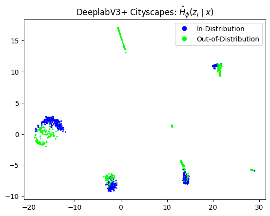
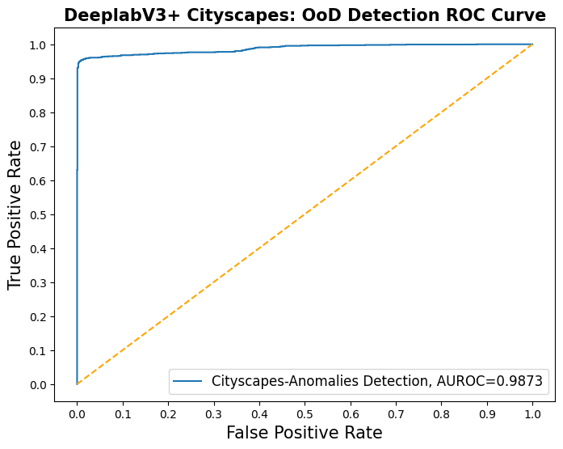

# CEA-LSEA: Out-of-Distribution Detection using DNN Latent Space Uncertainty Guide

## General Procedure 

Steps for using the package:

1. Load you Dataloader Pytorch-Lightning Module
2. Load your trained DNN PyTorch-Lightning Module
3. Add Hook to DNN Module for MC samples extraction
4. Get Monte-Carlo (MC) samples for In-Distribution (InD) samples dataloader, and Out-of-Distribution (OoD) samples dataloader
5. Get Entropy from InD and OoD MC samples
6. Build OoD Detection dataset (with InD and OoD samples)
7. Build OoD data-driven Detector (classifier)
8. Show OoD performance results

### General Python Package Imports

```python
import torch
import pytorch_lightning as pl
from pytorch_lightning.callbacks import ModelCheckpoint
from torchvision import transforms as transform_lib
from pytorch_lightning.callbacks import TQDMProgressBar
from torch.utils.data import Dataset
from torch.utils.data import DataLoader
import numpy as np
from dropblock import DropBlock2D
```

### Data Imports
```python
from dataset_utils.cityscapes import Cityscapes
from dataset_utils.cityscapes import CityscapesDataModule
from dataset_utils.woodscape import WoodScapeDataset
from dataset_utils.woodscape import WoodScapeDataModule
```

### DNN Model Imports
```python
from probabilistic_unet.probabilistic_unet_module import ProbabilisticUnetPriorMcdModule
from deeplab_v3p import DeepLabV3PlusModule
from dropblock import DropBlock2D
```

### Import LSEA-OoD Detection Package


```python
from ls_ood_detect_cea.uncertainty_estimation import Hook
from ls_ood_detect_cea.uncertainty_estimation import deeplabv3p_apply_dropout
from ls_ood_detect_cea.uncertainty_estimation import deeplabv3p_get_ls_mcd_samples
from ls_ood_detect_cea.uncertainty_estimation import get_dl_h_z
from ls_ood_detect_cea.ood_detection_dataset import build_ood_detection_ds
from ls_ood_detect_cea.dimensionality_reduction import plot_samples_pacmap
from ls_ood_detect_cea.detectors import KDEClassifier
from ls_ood_detect_cea.metrics import get_ood_detector_results, plot_roc_ood_detector
```


### Load Data Module

Example for Cityscapes dataset


```python
dataset_path = '/your/path/to/dataset/CityScapes'
batch_size = 1
```


```python
cs_dm_normal_dlv3p = CityscapesDataModule(data_dir=dataset_path,
                                          batch_size=batch_size,
                                          target_type='semantic',
                                          img_size=(256, 512),
                                          num_workers=10,
                                          drop_last=True,
                                          default_transforms=True, # Here this should be True!
                                          default_img_mask_transforms=False) # And here this should be False!

cs_dm_anomal_dlv3p = CityscapesDataModule(data_dir=dataset_path,
                                          batch_size=batch_size,
                                          target_type='semantic',
                                          img_size=(256, 512),
                                          num_workers=10,
                                          drop_last=True,
                                          default_transforms=False, # Here this should be False!
                                          default_img_mask_transforms=True) # And here this should be True! (Enable Anomalies)
```

Get datakiaders for In-Distribution (InD) and Out-of-Distribution (OoD) data.

```python
cs_dlv3p_train_loader = cs_dm_normal_dlv3p.train_dataloader()
cs_dlv3p_valid_loader = cs_dm_normal_dlv3p.val_dataloader()
cs_dlv3p_test_loader = cs_dm_normal_dlv3p.test_dataloader()

cs_dlv3p_anomaly_valid_loader = cs_dm_anomal_dlv3p.anomaly_val_dataloader()
cs_dlv3p_anomaly_test_loader = cs_dm_anomal_dlv3p.anomaly_test_dataloader()
```

### Load your trained DNN Module


```python
cs_dlv3p_path = "/path/to/your/DNN/model/lightning_logs/version_x/checkpoints/epoch=y-step=z.ckpt"
```


```python
cs_dlv3p_model = DeepLabV3PlusModule.load_from_checkpoint(checkpoint_path=cs_dlv3p_path)
```

### Place Hook at the output of Deeplabv3+ DropBlock2D layer


```python
cs_dlv3p_hook_dropblock2d_layer = Hook(cs_dlv3p_model.deeplab_v3plus_model.drop_block1)
```

### Get Monte-Carlo Samples


```python
device = torch.device('cuda' if torch.cuda.is_available() else 'cpu')
print(device)
```

    cuda

```python
cs_dlv3p_model.deeplab_v3plus_model.to(device);
cs_dlv3p_model.deeplab_v3plus_model.eval(); 
cs_dlv3p_model.deeplab_v3plus_model.apply(deeplabv3p_apply_dropout); # enable dropout
```


```python
mc_samples=10  # in this example we use 10 Monte-Carlo samples
```


```python
cs_dlv3p_valid_10mc_samples = deeplabv3p_get_ls_mcd_samples(cs_dlv3p_model, cs_dlv3p_valid_loader, mc_samples, cs_dlv3p_hook_dropblock2d_layer)
cs_dlv3p_test_10mc_samples = deeplabv3p_get_ls_mcd_samples(cs_dlv3p_model, cs_dlv3p_test_loader, mc_samples, cs_dlv3p_hook_dropblock2d_layer)
cs_dlv3p_valid_anomaly_10mc_samples = deeplabv3p_get_ls_mcd_samples(cs_dlv3p_model, cs_dlv3p_anomaly_valid_loader, mc_samples, cs_dlv3p_hook_dropblock2d_layer)
cs_dlv3p_test_anomaly_10mc_samples = deeplabv3p_get_ls_mcd_samples(cs_dlv3p_model, cs_dlv3p_anomaly_test_loader, mc_samples, cs_dlv3p_hook_dropblock2d_layer)
```


### Get Latent Representation Entropy $\mathcal{H}_{z}$


```python
cs_dlv3p_h_mvn_valid_samples_np, cs_dlv3p_h_z_valid_samples_np = get_dl_h_z(cs_dlv3p_valid_10mc_samples,
                                                                            mcd_samples_nro=10)
cs_dlv3p_h_mvn_test_samples_np, cs_dlv3p_h_z_test_samples_np = get_dl_h_z(cs_dlv3p_test_10mc_samples,
                                                                            mcd_samples_nro=10)
cs_dlv3p_h_mvn_valid_anomaly_samples_np, ws_dlv3p_h_z_valid_anomaly_samples_np = get_dl_h_z(cs_dlv3p_valid_anomaly_10mc_samples,
                                                                                            mcd_samples_nro=10)
cs_dlv3p_h_mvn_test_anomaly_samples_np, ws_dlv3p_h_z_test_anomaly_samples_np = get_dl_h_z(cs_dlv3p_test_anomaly_10mc_samples,
                                                                                          mcd_samples_nro=10)                                                                            
```


### Build Entropy-based OoD Detection Dataset

Show latent representation entropy $\mathcal{H}_{z}$ dataset projection in 2D:

```python
plot_samples_pacmap(ws_dlv3p_h_z_valid_samples_np,
                    ws_dlv3p_h_z_valid_anomaly_samples_np,
                    neighbors=28,
                    title="DeeplabV3+ Cityscapes: $\hat{H}_{\phi}(z_i \mid x)$")
```


    

    


Build dataset for OoD detection using InD and OoD (anomalies) samples.

```python
h_z_train_ds, labels_h_z_train_ds, h_z_test_ds, labels_h_z_test_ds = build_ood_detection_ds(cs_dlv3p_h_z_valid_samples_np,
                                                                                            cs_dlv3p_h_z_valid_anomaly_samples_np,
                                                                                            cs_dlv3p_h_z_test_samples_np,
                                                                                            cs_dlv3p_h_z_test_anomaly_samples_np)
```


### Build OoD Detector (Classifier)


```python
h_z_odd_monitor = KDEClassifier(bandwidth=0.8)
h_z_odd_monitor.fit(h_z_train_ds, labels_h_z_train_ds)
```


```python
h_z_odd_monitor_results = get_ood_detector_results("cs OoD monitor",
                                                   h_z_odd_monitor,
                                                   h_z_test_ds,
                                                   labels_h_z_test_ds)

h_z_odd_monitor_results
```


<div>
<style scoped>
    .dataframe tbody tr th:only-of-type {
        vertical-align: middle;
    }

    .dataframe tbody tr th {
        vertical-align: top;
    }

    .dataframe thead th {
        text-align: right;
    }
</style>
<table border="1" class="dataframe">
  <thead>
    <tr style="text-align: right;">
      <th></th>
      <th>fpr</th>
      <th>tpr</th>
      <th>auc</th>
      <th>acc</th>
      <th>mcc</th>
      <th>f1</th>
      <th>fpr@95</th>
    </tr>
  </thead>
  <tbody>
    <tr>
      <th>cs OoD monitor</th>
      <td>[tensor(0.), tensor(0.), tensor(0.), tensor(0....</td>
      <td>[tensor(0.), tensor(0.0007), tensor(0.0013), t...</td>
      <td>tensor(0.9873)</td>
      <td>tensor(0.9639)</td>
      <td>tensor(0.9302)</td>
      <td>tensor(0.9626)</td>
      <td>tensor(0.0072)</td>
    </tr>
  </tbody>
</table>
</div>


```python
plot_roc_ood_detector(h_z_odd_monitor_results,
                      "Cityscapes-Anomalies Detection",
                      "DeeplabV3+ Cityscapes: OoD Detection ROC Curve")
```

    

    
